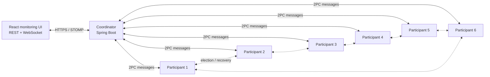

<div align="center">

# Distributed Two-Phase Commit Simulator

### Fault-tolerant distributed transactions with live fault injection, recovery and monitoring

<p>
  
  
  
  
</p>

<p>
  
  
  
  
</p>

</div>

---

## Overview

This project implements the **Two-Phase Commit protocol** across independent Spring Boot services and demonstrates how distributed transactions behave under coordinator, participant and network failures.

A React dashboard provides live system state, transaction controls, fault injection and event monitoring through REST APIs and WebSocket communication.

### What the project demonstrates

- coordination of distributed transactions across six independent participants
- `PREPARE`, voting, `COMMIT` and `ABORT` phases
- participant and coordinator fault injection
- ring-based coordinator election
- log-based transaction recovery
- peer consultation for resolving uncertain transactions
- comparison of behaviour with recovery enabled and disabled
- automated verification through 16 end-to-end fault scenarios
- more than 99% backend test coverage

---

## Architecture



| Component | Responsibility |
|---|---|
| Coordinator | Starts transactions, collects votes and broadcasts the final decision |
| Six participants | Execute protocol phases, persist votes and participate in recovery |
| React dashboard | Displays state, events and metrics and exposes fault controls |
| Docker Compose | Runs the complete eight-service environment |

<!--
Add one strong screenshot after creating it:

-->

---

## Fault-tolerance model

When the coordinator becomes unavailable after the voting phase, participants may remain in an uncertain state. The recovery path combines:

1. **Persistent voting logs** — a participant records its vote before responding.
2. **Coordinator election** — available participants elect a replacement coordinator.
3. **Peer consultation** — participants check whether another node already received the final decision.
4. **Decision replication** — a known `COMMIT` or `ABORT` decision is propagated.
5. **Configurable redundancy** — the same failure can be observed with recovery disabled and enabled.

### Supported failure categories

- participant crash
- coordinator crash
- network delay
- forced abort vote
- message loss
- transient and intermittent faults
- partial phase-two delivery
- compound and cascading failures

---

## Technology stack

| Area | Technologies |
|---|---|
| Backend | Java 21, Spring Boot 4, Spring Web, Reactor |
| Real-time communication | WebSocket, SockJS, STOMP |
| Frontend | React 19, TypeScript, Vite, Tailwind CSS |
| API documentation | SpringDoc OpenAPI, Swagger UI |
| Testing | JUnit 5, Mockito, Vitest, JaCoCo |
| Quality | Checkstyle, SonarQube |
| Delivery | Docker, Docker Compose, GitHub Actions, GitLab CI |
| Build | Maven multi-module build |

---

## Engineering decisions

### Independent services

The coordinator and every participant run as separate Spring Boot processes. This makes failures observable at service level rather than simulating all nodes inside one process.

### Logging before voting

Participant votes are persisted before being returned to the coordinator. This gives the recovery mechanism a durable local source of transaction state.

### Peer-based recovery

Participants can consult one another after coordinator failure. A known final decision takes precedence; otherwise, the elected coordinator resolves the uncertain transaction according to the available protocol state.

### Real-time observability

The dashboard receives system events through WebSocket instead of repeatedly polling every service. REST endpoints remain responsible for commands, configuration and point-in-time state.

---

## Quick start

### Requirements

- Java 21+
- Maven 3.9+
- Node.js 20+
- Docker and Docker Compose
- Bash-compatible shell

### Run the complete environment

```bash
git clone https://github.com/miluski/DistributedTwoPhaseCommitSimulator.git
cd DistributedTwoPhaseCommitSimulator

bash scripts/init-dev.sh
docker compose up --build
```

After startup:

| Service | Address |
|---|---|
| React dashboard | `https://localhost:3000` |
| Coordinator API | `https://localhost:8443/api` |
| Participant APIs | `https://localhost:8444`–`https://localhost:8449` |

The development environment uses self-signed certificates, so the browser may display a certificate warning.

---

## Testing and quality

Run the complete backend verification:

```bash
cd backend
mvn verify -Dcheckstyle.skip=true
```

The build enforces a minimum JaCoCo threshold of 75%. The current backend modules report **more than 99% line, instruction and method coverage**.

The project also includes:

- frontend tests with Vitest
- Checkstyle validation
- GitHub Actions and GitLab CI pipelines
- SonarQube configuration
- generated OpenAPI, Javadoc and TypeDoc documentation

---

## Project structure

```text
.
├── backend/
│   ├── common/
│   ├── coordinator/
│   └── participant/
├── frontend/
├── docs/
├── scripts/
├── compose.yaml
└── sonar-project.properties
```

Detailed documentation is available in `docs/`, including architecture, API, redundancy analysis and the user guide.

---

## Project context

This repository was developed as a university project for a fault-tolerant systems course. It focuses on distributed coordination, observable failure modes, automated recovery and testable system behaviour.
